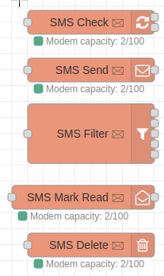
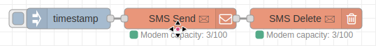

# ZTE SMS

ZTE SMS is a custom Node-Red node to interact with SMS messaging capabilities of ZTM LTE modem.
Tested on model `MF79U`.



## Install

Search for: `@zigasebenik/node-red-zte-sms`

Or install manually: `npm install @zigasebenik/node-red-zte-sms`

## Modem properties
Nodes (except for filter node) require modem configuration.


- **Name**: Name of the modem
- **Modem IP:** ZTE modem IP
- **Modem password:** password for the ZTE modem

## zte-sms-send node

Nodes sends the SMS message to selected number. Sent SMS is stored on modem and as modem has limited capacity of messages, consider deleting the sent message by wiring the output of this node into zte-sms-delete, to delete the SMS from mode after it was sent.

- **Name**: Name of the node
- **Modem**: select modem configuration
- **SMS message:** select to either send whole or part of the incoming node message as SMS
- **Phone number:** phone number of the SMS recipient 


Optionally you can define phone recipient number also through incoming node message instead of defining it in properties, by adding `recipientNumber` key.

```js
{
  payload: "your payload",
  recipientNumber: "123456789"
}
```

## zte-sms-delete node

Node deletes the SMS messages from modem storage. It's necessary to use this node or modem will eventually run out of SMS storage capacity.

- **Name**: Name of the node
- **Modem**: select modem configuration

Node will delete the SMS messages by message id. For convenience, output data structure of other zte-sms nodes is already in the correct format so you can just pipe the output of those node into this one.

```js
{
  payload: "your payload",
  sms: [ { id: '12', ... }, { id: '13' }, ... ]
}
```

## zte-sms-check node

Node checks for SMS messages stored on modem and will return all the messages. This includes `sent`, `received unread`, `received read`, `drafts`, `send failed`.
Node will check for messages on each input, so you can have an `inject`  node configured to ping this node every 5s or every 10min. Up to you.
Node has 2 outputs. First is array of all messages stored on modem, second one is modem capacity. For convenience, modem capacity is also displayed as status on every zte-sms node that has modem configured.

- **Name**: Name of the node
- **Modem**: select modem configuration


## zte-sms-filter node

This is a convenience node that doesn't require modem configuration, but can be helpful to filter messages from `zte-sms-check` node.

- **Name**: Name of the node
- **Phone number**: filter messages for allowed numbers. To specify 2 or more allowed numbers, delimit them with `;`

Node has 5 outputs, that filters SMS messages by it's type.
- 1st output: **Read received SMS**
- 2nd output: **Unread received SMS**
- 3rd output: **Sent SMS**
- 4th output: **Failed sent SMS**
- 5th output: **Draft SMS**

If you specified allowed phone number(s), node will exclude other messages.

## zte-sms-mark node

Node marks unread SMS messages as read.

- **Name**: Name of the node
- **Modem**: select modem configuration

## Example flow 1

Send SMS using `zte-sms-send` node and immediately delete it from modem using `zte-sms-delete` node.


## Example flow 2

Periodically check for messages with `zte-sms-check` node, pipe output to `zte-sms-filter` node (optionally limit the output to only allowed numbers), pipe already read SMS messages to `zte-sms-delete` node, pipe unread SMS messages to `zte-sms-mark` node to mark them as read, then do something with these new received messages.

